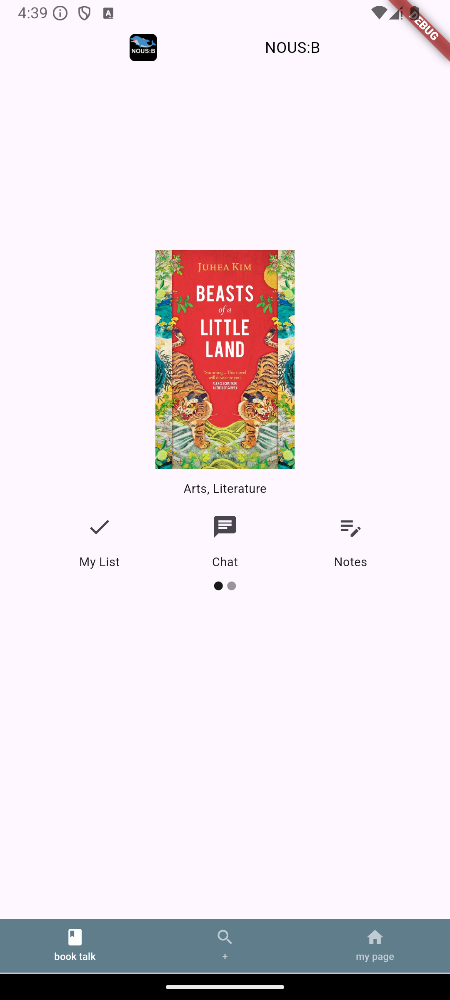
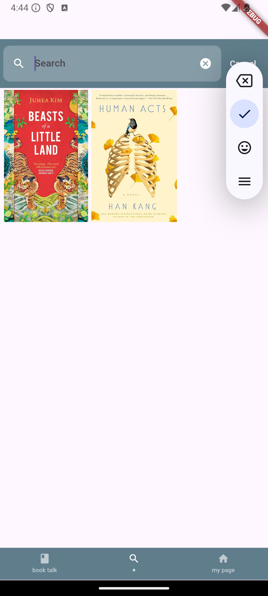
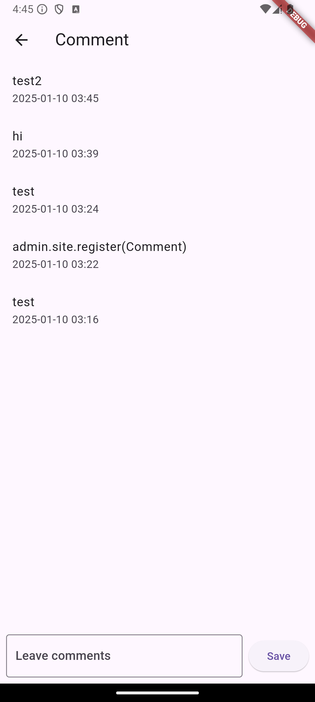

# NOUS:B
> 독서 토론 애플리케이션

<div style="display: flex; justify-content: center; gap: 10px; margin: 5px 0;">
  
  
  
</div>

<div style="display: flex; justify-content: center; gap: 10px; margin: 5px 0;">
  
  
  
</div>

## 소개
NOUS:B는 다음과 같은 의미를 담고 있습니다:
- 프랑스어 'nous'(우리)에서 영감을 받음
- 그리스어 'nous'(지식)의 의미도 포함
- 'B'는 Book의 약자로, "우리의 책" 또는 "지식의 책"을 의미

## 기술 스택
### 프론트엔드
- Flutter 3.24.5
- Dart 3.5.4
- DevTools 2.37.3

### 백엔드
- Python 3.9.21
- Django 4.2.17

## 주요 기능

### 메인 내비게이션
하단 내비게이션을 통해 접근 가능한 세 가지 주요 섹션:

1. **북토크 (홈)**
   - 개인 리스트에서 최대 4권의 도서 표시
   - 마이 리스트에 도서 추가
   - 댓글을 통한 커뮤니티 토론
   - 개인 메모 기능

2. **검색**
   - 제목/작가로 도서 검색
   - 상세 도서 정보 조회
   - 마이 리스트 빠른 추가

3. **마이페이지**
   - 사용자 프로필 정보
   - 계정 설정 관리

### 사용자 기능
- **인증**: 안전한 로그인 및 프로필 관리
- **개인 서재**: 도서 컬렉션 관리
- **개인 메모**: 개인 도서 메모 작성
- **커뮤니티**: 도서 토론 참여
- **도서 발견**: 다양한 도서 탐색

## 프로젝트 구조
```plaintext
frontend/
├── lib/
│   ├── common/
│   │   └── widget/
│   │       └── bottom_bar.dart
│   ├── feature/
│   │   ├── book_comment/          # 댓글 기능
│   │   ├── book_home/            # 홈 화면
│   │   ├── book_info/            # 도서 상세
│   │   ├── book_memo/            # 메모 기능
│   │   ├── book_search/          # 검색 기능
│   │   ├── login/               # 인증
│   │   └── my_page/             # 사용자 프로필
│   └── model/                   # 데이터 모델
```

각 기능 디렉토리는 다음을 포함합니다:
- `provider/`: 상태 관리
- `screen.dart`: UI 구현
- 추가 위젯 및 유틸리티