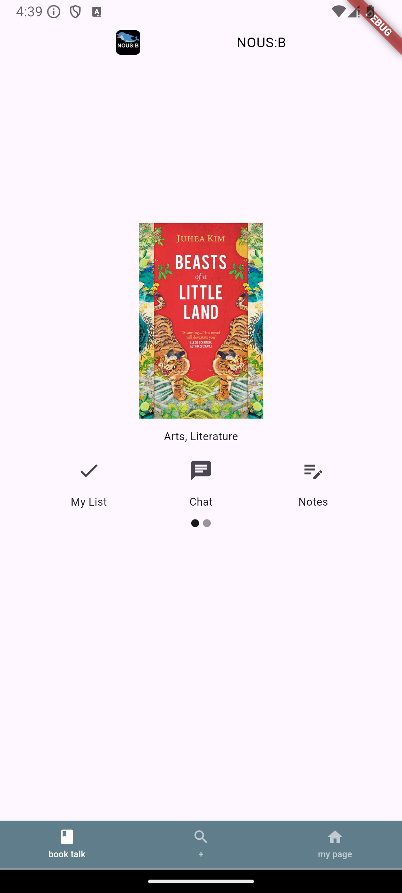
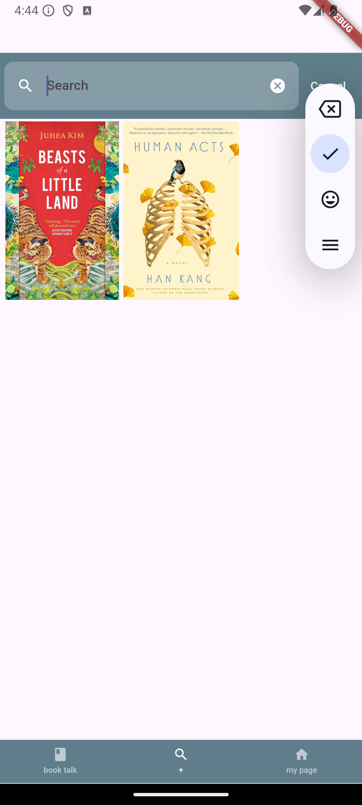
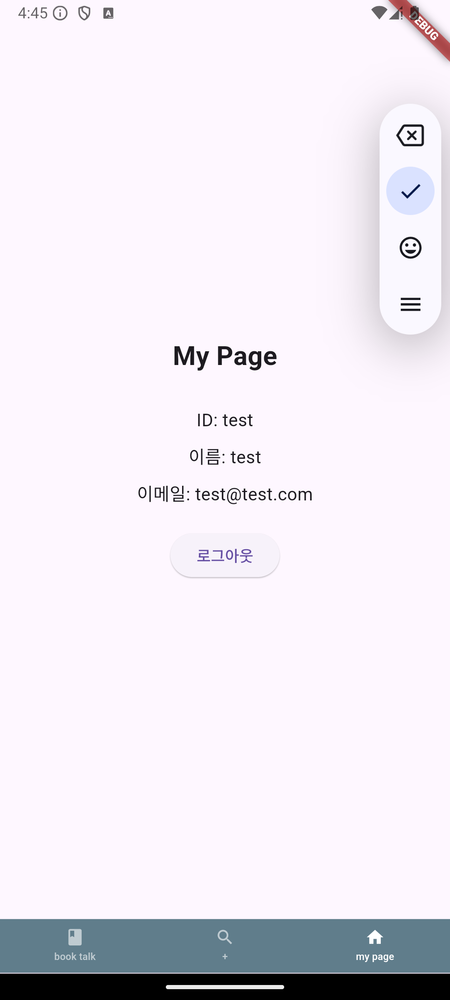
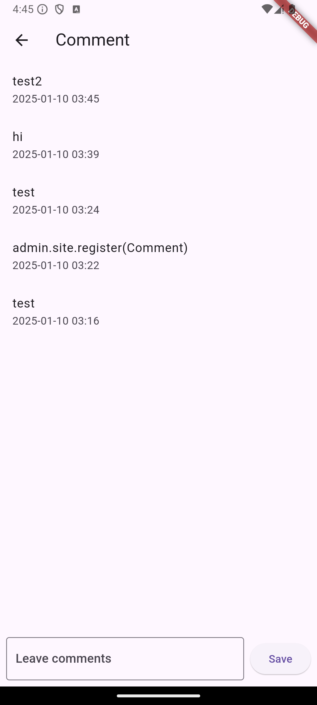

# NOUS:B
> A Book Reading and Discussion App

<div style="display: flex; justify-content: center; gap: 10px; margin: 5px 0;">
  
  
  
</div>

<div style="display: flex; justify-content: center; gap: 10px; margin: 5px 0;">
  
  
  
</div>

## About
NOUS:B combines multiple meaningful elements:
- Inspired by the French word 'nous' meaning 'us/we'
- Incorporates the Greek word 'nous' meaning 'Knowledge'
- The 'B' stands for Book, making it "Our Book" or "Knowledge Book"

## Tech Stack
### Frontend
- Flutter 3.24.5
- Dart 3.5.4
- DevTools 2.37.3

### Backend
- Python 3.9.21
- Django 4.2.17

## Features

### Main Navigation
The app provides three main sections via bottom navigation:

1. **Book Talk (Home)**
   - Display up to 4 books from personal list
   - Add books to My List
   - Community discussion through comments
   - Private memo feature

2. **Search**
   - Search books by title/author
   - View detailed book information
   - Quick add to My List

3. **My Page**
   - User profile information
   - Account settings management

### User Features
- **Authentication**: Secure login and profile management
- **Personal Library**: Manage your book collection
- **Private Notes**: Keep personal book notes
- **Community**: Engage in book discussions
- **Discovery**: Independent book exploration

## Project Structure
```plaintext
frontend/
├── lib/
│   ├── common/
│   │   └── widget/
│   │       └── bottom_bar.dart
│   ├── feature/
│   │   ├── book_comment/          # Comment feature
│   │   ├── book_home/            # Home screen
│   │   ├── book_info/            # Book details
│   │   ├── book_memo/            # Notes feature
│   │   ├── book_search/          # Search functionality
│   │   ├── login/               # Authentication
│   │   └── my_page/             # User profile
│   └── model/                   # Data models
```

Each feature directory typically contains:
- `provider/`: State management
- `screen.dart`: UI implementation
- Additional widgets and utilities